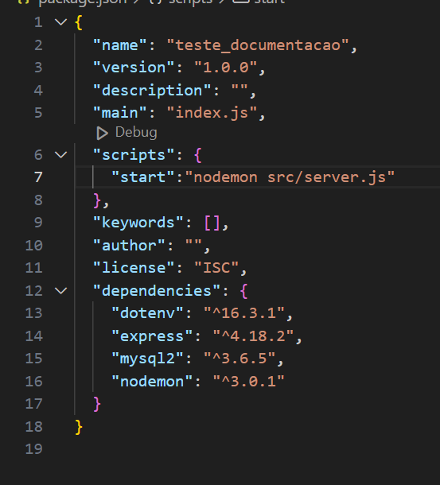

### Documentação da API
* abrir no terminal do gitbash
Definir local do computador para criar a pasta do projeto
***
mkdir Nome_do_Projeto
***
Acessar a pasta do projeto
***
cd Nome_Projeto
***
Abrir pasta no vscode
***
code .
***
Iniciar o gerenciador de pacotes Node
***
npm init -y
***
Criar arquivo .gitignore: arquivos e pastas que não vão para o github
***
*Cria o arquivo package.json para gerenciare os pacotes da aplicação

#   instalar pacotes da API:
* express: será o servidor da api
* nodemon: atualizar os arquivos alterados
* mysql2: integrar aplicação com o banco de dados
* dotenv:
touch .gitignore
***
* Arquivo responsavel por ignorar arquivos e pastas no github, ou seja, não serão visiveis no repositório remoto
Criar arquivo .env: armazenará as variáveis do ambiente
***
touch .env
***
instalar pacotes da API
***
npm i axpress nodemom dotenv mysql2
***
* express: será o servidor da api
* nodmon: atualizar os arquivos alterados sem parar o servidor
* dotenv: gerenciador de variáveis de ambiente

informar arquivos e pastas no .gitignore
***
node_modules
.env
***
Criar pasta src para estrutura do projeto
***
mkdir src
***
* Pasta responsavel por organizar a estrutura da API 
Criar arquivo server.js na pasta src
***
touch src/server.js
***
* Arquivo responsavel por rodar a aplicação(API)
***
Configurar o servidor
***
* colar codigo no server.js: 

// Importar pacote do express
const express = require('express');
// Instanciar o express na variavel app
const app = express();
// Importar um pacote dotenv
const dotenv = require('dotenv').config();
// defnir a porta do servidor
const PORT = process.env.PORT || 3005;

// Testar servidor 
app.listen(PORT, () => console.log(`Running at port ${PORT}`))
***

Criar comando para o servidor

* Criar comando para rodar o servidor no arquivo: 'package.js', dentro das chaves "scripts" no codigo abaixo:

 substitua a linha do "test" INTEIRO, pelo codigo abaixo:

```
"start":"nodemon src/server.js"
```
* Este comando é responsavel por rodar a API

Rodar o comando no terminal com GitBash
***
npm run start
***

### Criar estrutura para o projeto

Criar arquivo app.js na pasta src
```
touch src/app.js
```

* Arquivo responsavel da configuração no arquivo 'app.js':
```
// Importar pacote do express
const express = require('express');

// Instanciar o express na variavel app
const app = express();
app.use(express.json());

// Importar as rotas para serem executadas na aplicação
const crudRouter = require('./routes/crudRouter');
// Importar as rotas para serem executadas na aplicação
const alunosRouter = require('./routes/alunosRouter');

// Importar o pacote detenv
const dotenv = require('dotenv').config();

// HABILITAR A UTILIZAÇÃO DO CRUDROUTER
app.use('/api', crudRouter);
// HABILITAR A UTILIZAÇÃO DO CRUDROUTER
app.use('/api', alunosRouter);

// Setar a porta do servidor, a partir do arquivo .env
app.set('port', process.env.PORT);

// Exportar as configura ções do app para outros arquivos acessarem
module.exports = app;
```
### Rodar o comando 'npm i' sempre que fizer um clone do GitHub

### Criar o arquivo .env.example

* Criar arquivo para salvar as variáveis necessárias da aplicação sem os valores
```
touch .env.example
```

* Arquivos responsavel por definir as varievais de ambiente sem o valores

Colar as variaveis no arquivo '.env' segue o codigo abaixo:
```
# Definição da porta do servidos express
PORT = 3008

# Variáveis de conexão com banco
DB_HOST = 'localhost'
DB_USER = 'root'
DB_PASSWORD =  'root'
DB_DATABASE = 'turma_2at'
// DB_PORT = ''
```
* Por padrão o pacote mysql2, espera a conexão com banco na porta 3306
* Se o MYSQLworkbench não foi instalado na porta 3306, precisamos informar a porta correspondente no arquivo .env


----------------------
* Criar pasta routes

```
mkdir routes
```
* Criar arquivo crudRouter.js dentro da pasta routes
```
nano crudRouter.js
```
### Ctrl + O: Salvar o arquivo
### Enter: Confirmar nome do arquivo
### Ctrl + X: Fechar o arquivo

* Digitar o código no arquivo criado
```
// Importar pacote do express
const express = require('express');

/// Importar pacote do express
const { Router } = require('express');
// Instanciar o Router na variavel Router
const router = Router();
// Importar função do controller para acessar as funções
const { 
    listarDados,
    gravarDados,
    atualizarDados,
    deletarDados
} = require('../controllers/controller')

router.get('/listar', listarDados);

router.post('/gravar', gravarDados);

router.put('/atualizar/:id', atualizarDados);

router.delete('/deletar/:id', deletarDados)

module.exports = router;
```

function listarDados(request, response) {
    response.send('Retorno de lista de informações de banco de dados');
}

function gravarDados(request, response) {
    response.send('Metodo utilizado para salvar informações!');
}

function atualizarDados(request, response) {
    response.send('Metodo utilizado para salvar informações!');
}

function deletarDados(request, response) {
    response.send('Metodo utilizado para salvar informações!');
}

module.exports = {
    listarDados,
    gravarDados,
    atualizarDados,
    deletarDados,
}
```

<hr>

### Configurar estrutura de conexão com banco de dados

### Criar pasta 'config' dentro da pasta 'src'
```
mkdir src/config
```
### Criar arquivo 'db.js' dentro da pasta 'config'
```
touch src/config/db.js
```
### Colar o código no arquivo 'db.js'
```
// Importanto o pacote de conexão com banco de dados
const mysql = require('mysql2');
// Importar variaveis de conexão do banco
require('dotenv').config();

console.log(process.env.DB_HOST);

const connection = mysql.createConnection({
    host: process.env.DB_HOSt,
    user: process.env.DB_USER,
    password: process.env.DB_PASSWORD,
    datebase: process.env.DB_DATABASE
});

connection.connect( (err) => {
    if (err) {
        console.log('Erro de conexão: ' + err);
    } else {
        console.log('Mysql Connected!');
    }
});

module.exports = connection;
```

### Criar banco de dados

* Criar database
* Dar um use na database criada
* Criar tabelas


### Criar database
```
create database  NOME_DATABASE;
```
* CTRL + ENTER: executa o comando sql

### Selecionar a database 
```
use NOME_DATABASE
```

### Criar tabela de alunos
```
create table alunos(
    id int not null auto_increment,
    nome varchar(120) not null,
    dt_nascimento date not null,
    time_do_coracao varchar(120),
    primary key(id)
);
```

### Criar tabela users
```
create table users(
    id int not null auto_increment,
    ds_nome varchar(120),
    primary key(id)
);
```